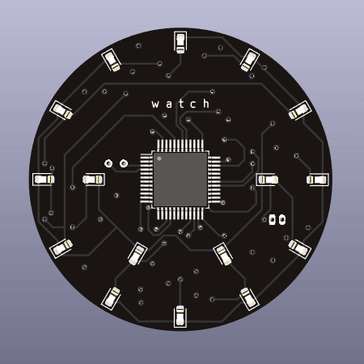

# WATCH   

This is a simple LED-wristwatch with 16 LEDs and one push button.
Everything is controlled by a STM32F103 and its realtime clock.
Time is visualized using 12 LEDs for the hours and 5 minute steps and 4 additional LEDs to indicate minute%5 .
The current hour LED will light up steady while the minute LEDs flash slowly.

## Specs:   
* handles 1S LIPO
* 38mm diameter
* 4 Layer PCB
* exposed I2C and UART interface for future extensions

